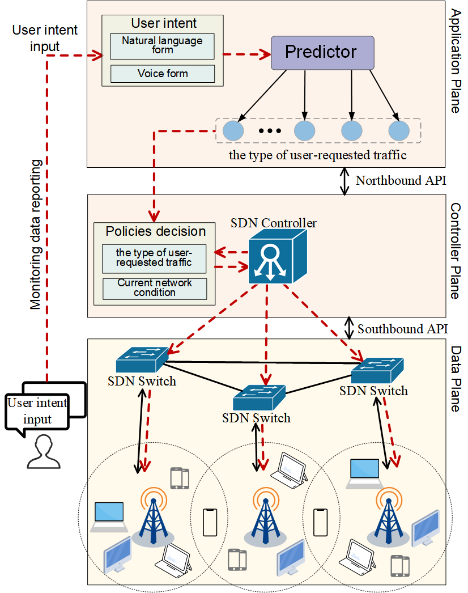

# UNIT
UNIT is a network management algorithm based on IBN. The algorithm optimizes network traffic forwarding through our adaptive strategy formulation and advanced deployment mechanism, significantly reducing network latency and packet interarrival time, ultimately improving user QoS.
## Highlights
- We design a predictor for forecasting the type of network traffic requested by users, achieving an accuracy rate of 98%.
- We propose an adaptive strategy formulation and advance deployment algorithm that effectively optimizes network
resource utilization and improves Quality of Service (QoS).
- Our dynamic strategy adjustment mechanism can update strategies in real-time according to network resource usage
and prediction results.
- Experimental evaluations show that our algorithm performs exceptionally well in various network environments,
meeting the latency and interarrival requirements of different traffic types.
- Our research significantly enhances the stability and adaptability of network services.

## Contents
```
.
├── dataset: the snip dataset.
├── cases: cases used in this work.
├── scripts: script file in simulation experiment.
├── category.py: classification tree class.
├── main.py: the main function.
├── predict.py: model reading and prediction class.
├── report.py: print evaluation report.
├── utils.py: helper codes.
└── topology.py: network topology.

```
## The Architecture of UNIT
<center>
    
    <br>
    <div style="color:orange; border-bottom: 1px solid #d9d9d9;
    display: inline-block;
    color: #999;
    padding: 2px;">The Architecture of UNIT</div>
</center>

## The Flow Chart of Different Algorithms
<center>
    
    <br>
    <div style="color:orange; border-bottom: 1px solid #d9d9d9;
    display: inline-block;
    color: #999;
    padding: 2px;">The Flow Chart of Different Algorithms</div>
</center>

1. When user-requested traffic arrives at the switch without a matching
forwarding flow table, the switch sends this traffic to the IBN controller (step 3), either awaiting the controller to issue an appropriate forwarding policy (step 4) or forwarding it based on a default route. 
2. Our Predictor module predicts the type of traffic requested by the user (step 3). It optimizes forwarding strategies based on the QoS requirements and network conditions associated with that traffic type (step 4). These strategies are then deployed to the switch before the user’s traffic reaches it (step 5).

## About user intents prediction experiment
### Requirements
python >= 3.6  
numpy==1.19.2  
scipy==1.5.4  
scikit-learn==0.23.2  
jieba==0.42.1  
tqdm==4.54.1

### How to predict the intent of user's request experiments
1. Download Snip Dataset from [here](https://github.com/snipsco/snips-nlu?utm_source=catalyzex.com).
2. Data processing
The processed data is shown in the folder cases.
3. Training prediction model
```python3 main.py```
4. Print the reports
```python3 report.py```
5. make predictions using the trained model
```python3 predict.py```

### The performance of user-requested traffic prediction
|       | Precision|   Recall  |  F1-score |
| :---: |:--------:| :-------: | :-------: |
| Audio |   0.95   |    0.96   |    0.96   |
| Chat  |   1.00   |    0.93   |    0.96   |
| VoIP  |   0.99   |    0.97   |    0.98   |
| Video |   0.95   |    1.00   |    0.97   |
| Email |   0.99   |    0.78   |    0.88   |
| File  |   1.00   |    1.00   |    1.00   |
| Web   |   0.99   |    0.98   |    0.99   |
|Average|   0.98   |    0.95   |    0.96   |

## About the traffic scheduling experiments

### Environmental requirement
1. Linux OS (e.g., CentOS, RedHat, Ubuntu).
2. [Miniet](https://mininet.org/) (with OpenFlow version 1.3)
3. [Ryu controllers](https://ryu-sdn.org/)
4. [MGEN](https://github.com/USNavalResearchLaboratory/mgen) (Multi-Generator traffic generation tool)
5. [nload](https://github.com/rolandriegel/nload) (Real-time network traffic monitor)
6. [bmon](https://github.com/tgraf/bmon) (Real-time network traffic monitor)
7. [Trpr](https://perso.liris.cnrs.fr/alain.mille/enseignements/iup_reseau/TP_apprentis_2004/trpr.htm) (TRace Plot Real-time)
8. [tcpdump](https://www.tcpdump.org/) (a powerful command-line packet analyzer)
8. [gunplot](http://gnuplot.info/docs_6.1/Gnuplot_6.pdf) (An Interactive Plotting Program)

### Network topology
<center>
    
    <br>
    <div style="color:orange; border-bottom: 1px solid #d9d9d9;
    display: inline-block;
    color: #999;
    padding: 2px;">The Prototype Topology Network of Our Simulation
Experiment.</div>
</center>

### How to run

#### step1: Start the RYU controller in the terminal ```ryu-manager example_switch_13.py```.
#### step2: Run mininet in another terminal ```miniet mn --controller=remote``` (we can also use a custom network topology with ```python3 topology.py```).
#### step3: Open terminals S1 and T2 ```xterm S1 T2```.
#### step4: As the traffic sender, S1 runs the Mgen script file ```mgen input test_input.mgn```.
#### step5: As the traffic receiver, T1 runs the Mgen script file ```mgen input test_listen.mgn output test_output.drc```.
#### step6: Use bmon to monitor the network bandwidth in real time and write to the bandwidth.txt file ```./scripts/bmon.sh```. And then Use data.py to extract bandwidth data from the bandwidth.txt file ```python3 data.py```.
#### step7: At the same time, monitor network traffic in real time using ```nload```.
#### step7: Use trpr to analyze information such as delay and interarrival according to the monitored information. ```../trpr interarrival drec input test_output.drc auto X output late.txt``` and ```../trpr latency drec input test_output.drc auto X output late.txt```.
#### step8: Plot using gunplot ```gunplot gunplot.txt```.